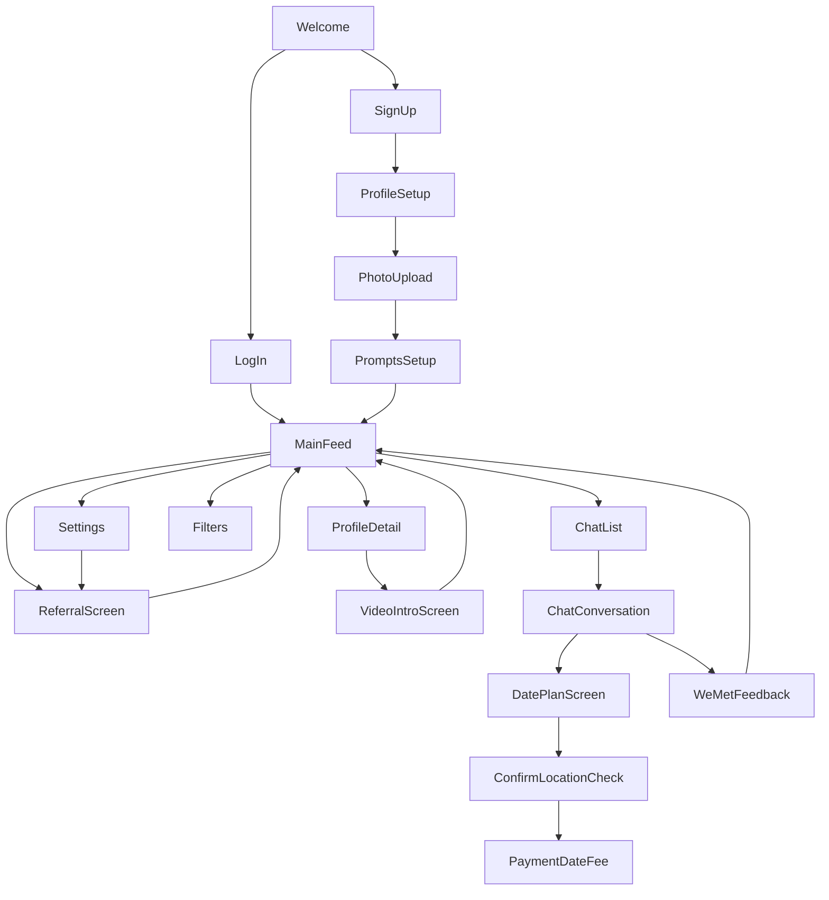

# Introduction

You’re building an empathy-driven dating app on React Native + Expo whose mission is simple: **help people find real connections—and get paid only when they do.** Every feature, from likes to chats to in-person meetups, is designed to align your incentives with your users’. You don’t monetize endless swiping or ghosting—revenue comes only when two people actually meet and both agree they’d like to meet again. That commitment-first model fosters honesty, reduces superficial engagement, and makes every match meaningful.

## Technology Stack
	•	Framework: React Native (v0.79) + Expo SDK 53.0.0
	•	Language: TypeScript (strict mode, interfaces over types)
	•	Navigation: React Navigation v7.x
	•	State 🔄 Caching: Redux Toolkit + React-Redux, React Query
	•	UI:
	•	Expo’s built-in components
	•	Flexbox + useWindowDimensions for responsiveness
	•	styled-components or Tailwind CSS
	•	Dark mode via Expo’s useColorScheme
	•	ARIA/native accessibility props
	•	react-native-reanimated + gesture-handler for animations
	•	Backend as a Service: Firebase (Auth, Firestore, Realtime Database, Storage, Security Rules, Emulator Suite) via MCP
	•	Testing: Jest + React Native Testing Library, Jest snapshots, Detox CLI for E2E
	•	Lint & Format: ESLint (Airbnb) + Prettier
	•	CI/CD & Builds: GitHub Actions/CircleCI/Codemagic, Expo Application Services (EAS)

## Application Concept & Incentive Alignment

1. **Date Fee (€1)**: Charged into escrow in Firebase when both users schedule and attend a date; released to you via Stripe **only** if, after the meetup, both answer “yes” to **“Would you meet again?”**
2. **Relationship Fee (€10)**: Later, if a long-term relationship is declared (e.g. via a manual toggle in Settings), you trigger a larger closing fee.

**Key Incentives**

* **We Met Review Only**: After each date, prompt both users:

  * “Did you meet?”
  * “Would you meet again?”
* If **either** says **“no”** to “meet again,” you:

  * **Close the match** (they can still share contacts in person).
  * **Notify the user** that you won’t show them people similar to that match moving forward—degrading their personalized ranking algorithm as a gentle penalty for non-commitment or dishonest feedback.
* If later location data shows they did meet again after a “no,” you’ll **re-prompt**; a second “no” leads to an account ban and a notification—further aligning honesty.

## Navigation Flow



## Screens & Feature Interactions

1. **Welcome / Auth**

   * Sign up or log in (Email/password + OAuth) via Firebase Auth.
   * Capture general privacy consent—incl. 3-day location checks—for all future date verifications.

2. **Profile Setup**

   * **PersonalInfoScreen**: collect name, age, gender, location (consent to 3-day location checks via privacy form).
   * **PhotoUploadScreen**: upload ≥3 photos to Firebase Storage.
   * **PromptsSetupScreen**: select 3 prompts; answer via text or optional voice note.

3. **Main Feed (DiscoverScreen)**

   * Card UI: photo carousel, prompt snippets, mutual-friends badge.
   * **Like Logic:**

     * Likes 1–6 per day: free.
     * Likes 7–10: require a **unique text** (≥80 characters, no repeats).
     * Likes >10: require a **video intro** (5–60 seconds).
   * On like: write to Firestore `likes`; on mutual like, create a `chats` thread.

4. **Video Intro**

   * **VideoIntroScreen**: record/select clip; upload to Firebase Storage; attach URL to the like record.

5. **Profile Detail**

   * Show full gallery, prompt answers, and “Like / Comment / Message” buttons.

6. **Chat**

   * **ChatListScreen**: list conversations, ordered by “vitality” (video > audio > image > text).
   * **ChatConversationScreen**: real-time messaging via Firestore or RTDB; mark up with `testID` for E2E.

7. **Date Planning**

   * **DatePlanScreen**: propose date time & location → write to Firestore `dates`.
   * During the 3-day window, verify both users’ proximity via Firebase geolocation queries → on success, charge €1 into escrow (Stripe + Firestore `payments`).

8. **We Met Feedback**

   * **WeMetFeedbackScreen**: ask “Did you meet?” + “Would you meet again?” + optional comments.
   * If **both** answer **“yes”**, mark feedback `success=true`, release escrow → you earn.
   * If **any** answers **“no”**, close match, notify them that **similar profiles will no longer appear**, and degrade their personalized ranking algorithm.

9. **Referral**

   * **ReferralScreen**: shareable link, show free-date credits earned (2 referrals → 1 free date). Credits auto-apply at payment screens; no redemption limits.

10. **Settings**

    * Edit profile, toggle privacy (incl. location consent), pause/hide profile, view credits, logout, delete account, declare “long-term relationship” to trigger a €10 fee.

---

## Firebase Services & Data Models

```ts
// src/services/firebase.ts
import auth from '@react-native-firebase/auth';
import firestore from '@react-native-firebase/firestore';
import database from '@react-native-firebase/database';
import storage from '@react-native-firebase/storage';

export const FirebaseAuth = { /* signUp, signIn, signOut */ };
export const Firestore = {
  profiles: () => firestore().collection('profiles'),
  likes: () => firestore().collection('likes'),
  chats: (chatId: string) =>
    firestore().collection(`chats/${chatId}/messages`),
  dates: () => firestore().collection('dates'),
  feedback: () => firestore().collection('weMetFeedback'),
  referrals: () => firestore().collection('referrals'),
  payments: () => firestore().collection('payments'),
};
export const RTDB = { chatRef: (chatId: string) =>
    database().ref(`/chatMessages/${chatId}`) };
export const Storage = {
  upload: (path: string, file: string) => storage().ref(path).putFile(file),
  getURL: (path: string) => storage().ref(path).getDownloadURL(),
};
```

**Firestore Schema**

* `profiles/{userId}`: `{ name, age, gender, location: GeoPoint, metadata, locationConsent: boolean }`
* `likes/{likeId}`: `{ fromUser, toUser, vitality: number, text?: string, videoUrl?: string, createdAt }`
* `chats/{chatId}/messages/{messageId}`: `{ senderId, content, type, createdAt }`
* `dates/{dateId}`: `{ users: [A, B], scheduledAt, location, status, locationVerified: boolean }`
* `weMetFeedback/{feedbackId}`: `{ userId, matchId, met, again, comments, createdAt }`
* `referrals/{referralId}`: `{ referrerId, referredId, activated, creditType }`
* `payments/{paymentId}`: `{ userId, amount, type, status, timestamp }`

**Indexes & Scaling**

* Composite indexes for location+age filtering.
* Architect collections to shard write hotspots and support 1M+ users.
